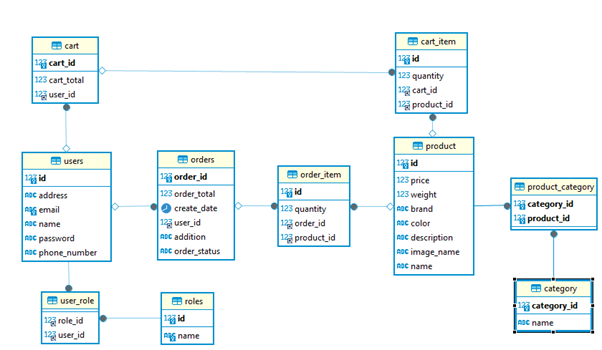
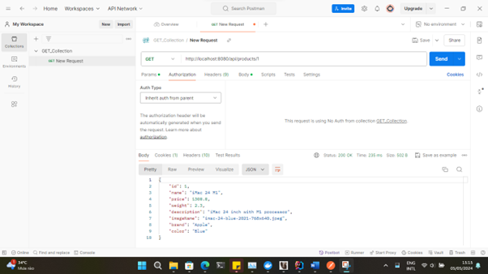
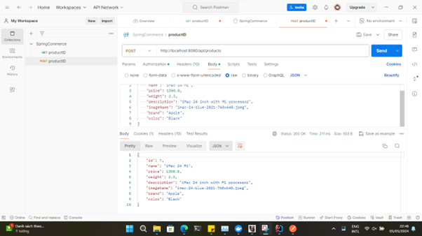
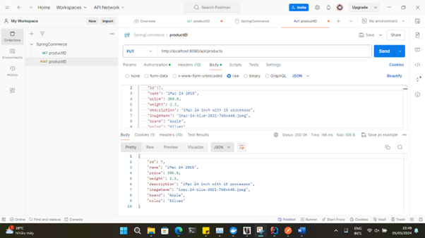
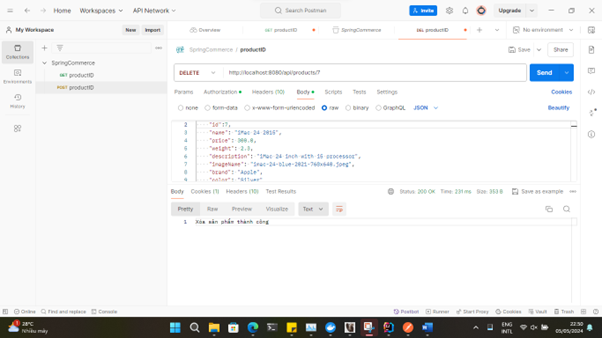

# Overview

In building an Apple Device Sales e-commerce website with Spring MVC, several software development principles, patterns, and practices come into play. Principles such as DRY (Don't Repeat Yourself) and KISS (Keep It Simple, Stupid) ensure the codebase is efficient and maintainable. Design patterns like MVC (Model-View-Controller) and Repository pattern are commonly used in such applications to separate concerns and simplify data access. Best practices include continuous integration and delivery, unit testing, and adherence to SOLID principles for object-oriented design, contributing to a robust and scalable e-commerce platform. These practices are crucial for creating a user-friendly, secure, and high-performing website.

Build tool: IntelliJ IDEA, Thymeleaf, MySQL, and Java 17.

# Project Structure

An e-commerce website typically has a layered structure that separates the front-end and back-end functionalities. The front-end, which is the part users interact with, is built using HTML for structure, CSS and Bootstrap for styling, JavaScript for interactivity, and Thymeleaf as a template engine to dynamically display content. The back-end, responsible for server-side operations, is powered by Java Spring Boot, which is a robust framework for building web applications and APIs, and MySQL, a relational database management system, for storing and retrieving data efficiently.

# How to run on local

1. Pull this source code from github.
2. Open terminal and cd to project folder contain the docker-compose.yml file:

“cd C:\\Users\\SpringCommerce\\src\\main\\resources\\database”

After that run “docker-compose up” command in your terminal (install Docker Desktop if your pc does not have it).

3. Using DBeaver or other client database management to connect to the mySQL database:

- Serverhost: localhost
- Port: 3306
- Database: PhoneFactory
- Username: root
- Password: abc123

4. Open this project with Intellij IDEA and run the program.

Notice: This program is built with JDK 17, so if your JDK is less than 17, please update your JDK.

# APIs Testing by Postman

- \[GET\] Request: GET by productID

- \[POST\] Request: POST by productId

- \[PUT\] Request: PUT by productId

- \[DELETE\] Request: delete by productId

# Link

- Github: <https://github.com/bintrn2703/spring-commerce>
- Video Demo (use TDTU Email): <https://drive.google.com/drive/folders/11W5ze7QoEPXXQXSpoeFXRJjfqNTORSHA?usp=sharing>